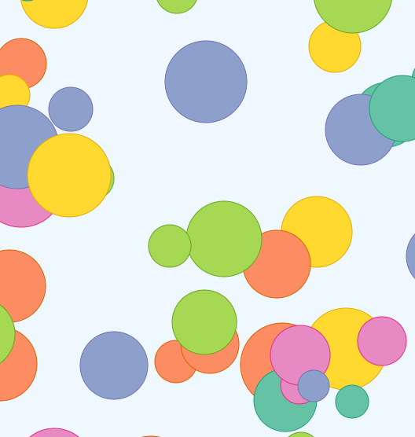
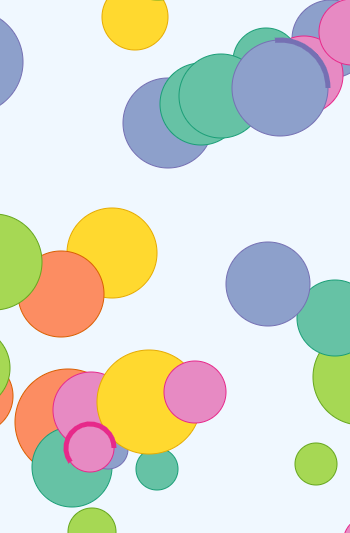
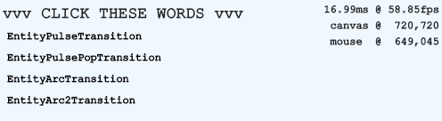

# canvasAnimations
Experiments with animations and attention

## Transitions
- Pulse - Grow/shrink radius
- Pulse Pop - Grow and then reset
- Arc - Stroke arc from 0 to 360
- Arc 2 - Stroke arc which chases
<table>
    <tr>
        <td>Circle entities to animate</td>
        <td>Radius based transitions</td>
    </tr>
    <tr>
        <td></td>
        <td></td>
    </tr>
    <tr>
        <td colspan="2">Interface for clicking transitions</td>
    </tr>
    <tr>
        <td colspan="2"></td>
    </tr>
</table>

## Future Features
- Color smoothing
- Color blink
- Fade rest of observations
- Shake
- Bounce
